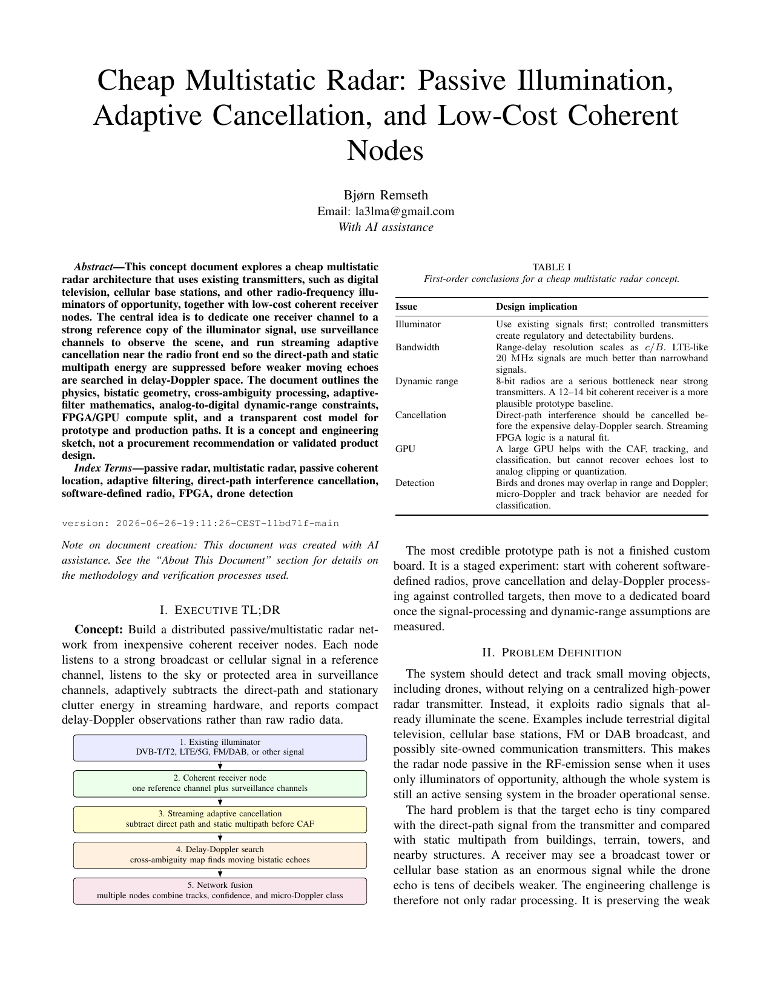

# Cheap Multistatic Radar: Passive Illumination, Adaptive Cancellation, and Low-Cost Coherent Nodes

A systems-design concept for a low-cost passive/multistatic radar network using broadcast, cellular, or other illuminators of opportunity, coherent receiver nodes, streaming adaptive cancellation, delay-Doppler processing, observation vectors, simulation-first prototyping, and a Norway/Europe capability landscape for possible civilian and academic contributors.

**Date:** 2026-06-26

[Systems Design](../themes/systems-design.md){ .theme-chip } [Defence Innovation](../themes/defence-innovation.md){ .theme-chip } [Radar](../themes/radar.md){ .theme-chip } [Sensor Fusion](../themes/sensor-fusion.md){ .theme-chip } [Drones](../themes/drones.md){ .theme-chip }

[Open PDF](../pdf/cheap-multistatic-radar.pdf) | <a href="../pdf/cheap-multistatic-radar.pdf" download>Download PDF</a>

{ .paper-thumb-large }

## Inline Reader

<iframe src="../pdf/cheap-multistatic-radar.pdf#view=FitH" class="pdf-frame" title="Cheap Multistatic Radar: Passive Illumination, Adaptive Cancellation, and Low-Cost Coherent Nodes" loading="lazy"></iframe>
